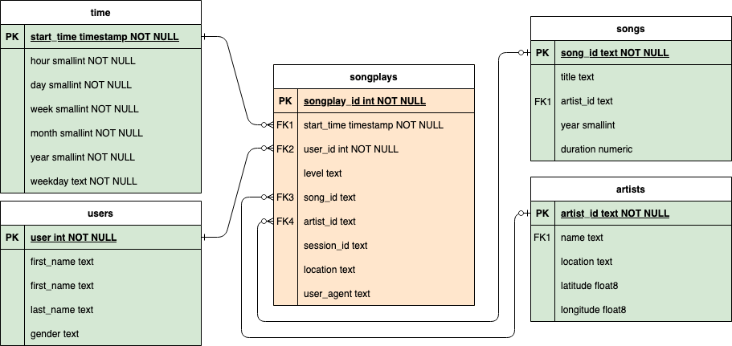

# Project: Data Modeling with Postgres

## Overview

A startup called Sparkify wants to analyze the data they've been collecting on songs and user activity on their new music streaming app. The analytics team is particularly interested in understanding what songs users are listening to. Currently, they don't have an easy way to query their data, which resides in a directory of JSON logs on user activity on the app, as well as a directory with JSON metadata on the songs in their app.

## Song Dataset

The first dataset is a subset of real data from the [Million Song Dataset](https://labrosa.ee.columbia.edu/millionsong/). Each file is in JSON format and contains metadata about a song and the artist of that song. The files are partitioned by the first three letters of each song's track ID. For example, here are filepaths to two files in this dataset.

## Log Dataset

The second dataset consists of log files in JSON format generated by this [event simulator](https://github.com/Interana/eventsim) based on the songs in the dataset above. These simulate activity logs from a music streaming app based on specified configurations.

## Database schema


### Fact Table

**songplays** - records in log data associated with song plays i.e. records with page NextSong

### Dimension Tables

**users** - users in the app

**songs** - songs in music database

**artists** - artists in music database

**time** - timestamps of records in songplays broken down into specific units

## Project files

`test.ipynb` displays the first few rows of each table to let you check your database.

`create_tables.py` drops and creates your tables. You run this file to reset your tables before each time you run your ETL scripts.

`etl.ipynb` reads and processes a single file from song_data and log_data and loads the data into your tables. This notebook contains detailed instructions on the ETL process for each of the tables.

`etl.py` reads and processes files from song_data and log_data and loads them into your tables. You can fill this out based on your work in the ETL notebook.

`sql_queries.py` contains all your sql queries, and is imported into the last three files above.

## Dependencies

- Python 3.6 or newer
- PostgreSQL 9.6 or newer
- `virtualenv` python package to create venv dir
- `docker` and `docker-compose`

## Run

### Create and activate virtual environment
```shell
virtualenv venv
source venv/bin/activate 
```

### Install dependencies
```shell
python -m pip install -r requirements.txt
```

### Bootstrap PostrgeSQL server in docker
```shell
docker-compose up -d
```

### Create (or recreate) the database schema
```shell
python create_tables.py
```

### Run ETL job
```shell
python etl.py
```