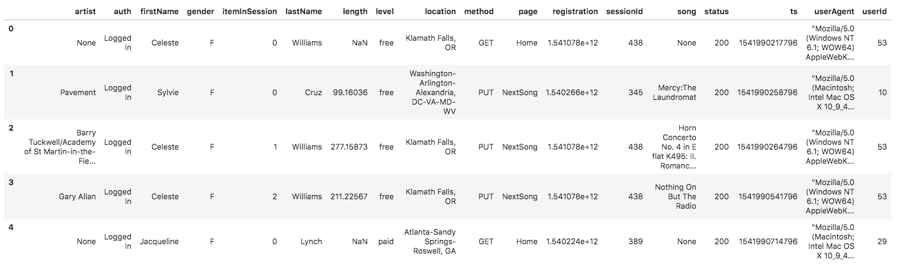

# project_3_data_lake

## Introduction
A music streaming startup, Sparkify, has grown their user base and song database even more and want to move their data warehouse to a data lake. Their data resides in S3, in a directory of JSON logs on user activity on the app, as well as a directory with JSON metadata on the songs in their app.

As their data engineer, you are tasked with building an ETL pipeline that extracts their data from S3, processes them using Spark, and loads the data back into S3 as a set of dimensional tables. This will allow their analytics team to continue finding insights in what songs their users are listening to.

In this project, you'll apply what you've learned on Spark and data lakes to build an ETL pipeline for a data lake hosted on S3.

## Files
- [etl.py](etl.py) - The pipeline the spark cluster is running is a single python file
- [dl.sample.cfg](dl.sample.cfg) - Pipeline configuration example
- [input_data/](input_data) - The data you will need to upload to an S3 bucket in same region as your EMR cluster

## Data lake and data sets
You'll be working with two datasets
- Song data: [input_data/song_data](input_data/song_data)
- Log data: [input_data/log_data](input_data/log_data)

### Song Dataset
The first dataset is a subset of real data from the Million Song Dataset. Each file is in JSON format and contains metadata about a song and the artist of that song. The files are partitioned by the first three letters of each song's track ID. For example, here are filepaths to two files in this dataset.
```shell
song_data/A/B/C/TRABCEI128F424C983.json
song_data/A/A/B/TRAABJL12903CDCF1A.json
```
Below is an example of what a single song file, `TRAABJL12903CDCF1A.json`, looks like.
```json
{
    "num_songs": 1,
    "artist_id": "ARJIE2Y1187B994AB7",
    "artist_latitude": null,
    "artist_longitude": null,
    "artist_location": "",
    "artist_name": "Line Renaud",
    "song_id": "SOUPIRU12A6D4FA1E1",
    "title": "Der Kleine Dompfaff",
    "duration": 152.92036,
    "year": 0
}
```

### Log Dataset
The second dataset consists of log files in JSON format generated by this event simulator based on the songs in the dataset above. These simulate app activity logs from an imaginary music streaming app based on configuration settings.

The log files in the dataset you'll be working with are partitioned by year and month. For example, here are filepaths to two files in this dataset.
```shell
log_data/2018/11/2018-11-12-events.json
log_data/2018/11/2018-11-13-events.json
```
Below is an example of what the data in a log file, 2018-11-12-events.json, looks like.


## How to run this
Note: This project utilises a spark cluster running on AWS EMR service. Fore more instructions on how to set up an EMR cluster from scratch, see [Spark on EMR](../aws_service_setup/spark_on_emr/README.md) instructions.

Warning! Do not forget to shut down your AWS cluster. EMR should never be left running idle. You can find shutdown from CLI instructions in [Spark on EMR](../aws_service_setup/spark_on_emr/README.md).

### Update configuration file
```shell
# Copy the sample configuration file
cp dl.sample.cfg dl.cfg

# Update the newly created configuration file
# 1. Update the AWS section with a valid AWS access key and secret key
# 2. Update the SPARK section with a valid s3 location for both input and output directories
vim dl.cfg
```

### Upload the input data folder to your S3 bucket that resides in same region as EMR cluster
You can do this via AWS web console or use the following AWS CLI command
```shell
aws --profile YOUR_AWS_CONFIGURATION_PROFILE s3 cp --recursive input_data s3://YOUR_S3_BUCKET/input_data
```
Note: Make sure you have created the directory for OUTPUT_DIR (See configuration file)

### Update etl.py with proper input and output paths
Replace
```shell
    # The directory paths for Sparkify input and output data
    input_data = 's3://udacity-data-engineer-nanodegree/project_3_data_lake/input_data/'
    output_data = 's3://udacity-data-engineer-nanodegree/project_3_data_lake/output_data/'
```
With valid paths you have access to.

### Upload the pipeline file and configuration to EMR cluster's master node
```shell
scp -i YOUR_KEYPAIR_FILE.pem dl.cfg hadoop@AWS_EMR_MASTER_HOST:
scp -i YOUR_KEYPAIR_FILE.pem etl.py hadoop@AWS_EMR_MASTER_HOST:
```

### SSH into master node and submit the ETL job for execution
```shell
ssh -i YOUR_KEYPAIR_FILE.pem hadoop@AWS_EMR_MASTER_HOST
```

```shell
spark-submit etl.py
```
