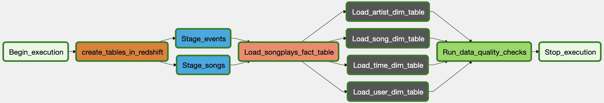
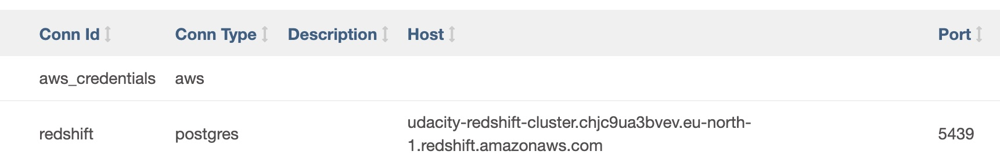
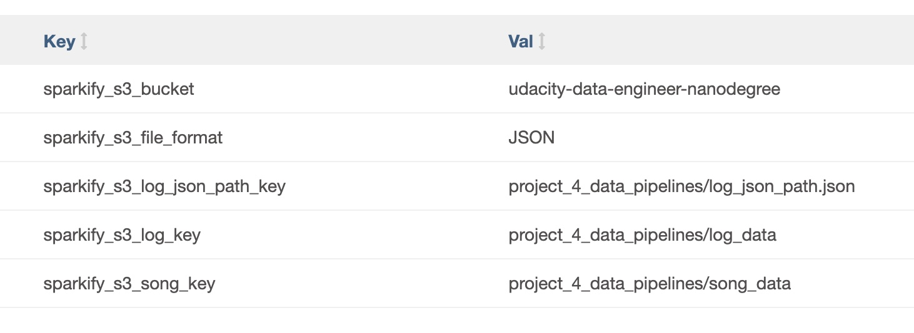

# Project 4 - Data Pipelines

## Introduction

### Use Case

A music streaming company wants to introduce more automation and monitoring to their data warehouse ETL pipelines and they have come to the conclusion that the best tool to achieve this is Apache Airflow. As their Data Engineer, I was tasked to create a reusable production-grade data pipeline that incorporates data quality checks and allows for easy backfills. Several analysts and Data Scientists rely on the output generated by this pipeline and it is expected that the pipeline runs daily on a schedule by pulling new data from the source and store the results to the destination.

## Data Pipeline design

Pipeline name is `sparkify_data_pipeline`

1. Create the table objects in Redshift cluster, if they do not exist
2. Load song and log data into redshift staging tables
3. Transform the data in staging tables into a star schema
4. Perform data validation and data quality checks



### Additional requirements
- The DAG should not have any dependencies on past runs
- On failure, the task is retried for 3 times
- Retries happen every 5 minutes
- Catchup is turned off
- Do not email on retry or failures

### Airflow plugin and operators

As part of the project a new plugin is created and custom operators implemented.

[sparkify_plugin](airflow/plugins/__init__.py) that implements [custom operators](airflow/plugins/operators/__init__.py)

## Running the pipeline

### Prerequisites

You must have at minimum read access to S3 bucket containing the song and log data. The data can be found in `data.zip` archive.

In addition you must have full access to a redshift database. Instructions on setting up a redshift cluster can be found [here](../aws_service_setup/redshift/README.md)

- Docker
- Docker compose

### Running Airflow cluster

The provided [docker-compose.yaml](docker-compose.yaml) file should be used to set up local airflow cluster.
```shell
docker-compose up -d
```
Check the logs to see when Airflow cluster is ready
```shell
docker-compose logs -f -t
```
When cluster is ready, one can access it via `http://localhost:8080`. Username and password are the same: `airflow`

### Configuring Airflow

Before you can run the provided pipeline, one must first configure following resources

#### Connections
- Redshift
- AWS



#### Variables
- sparkify_s3_bucket - S3 bucket containing song and log data
- sparkify_s3_log_key - File path to the directory containing log data
- sparkify_s3_log_json_path_key - File path to `log_json_path.json`
- sparkify_s3_song_key - File path to the directory containing song data
- sparkify_s3_file_format - Data file format



## Development
1. Clone the repository
```shell
git clone https://github.com/jpuris/udacity-data-engineering-submissions.git
cd udacity-data-engineering-submissions
```
2. Create virtual environment and activate it
```shell
# install virtualenv package
python3 -m pip install virtualenv

# create new virtual env
virtualenv venv

# activate virtual env
source venv/bin/activate
```
3. Install dependencies
```shell
cd project_4_data_pipelines

python -m pip install -r requirements.txt
python -m pip install -r requirements-dev.txt
```
